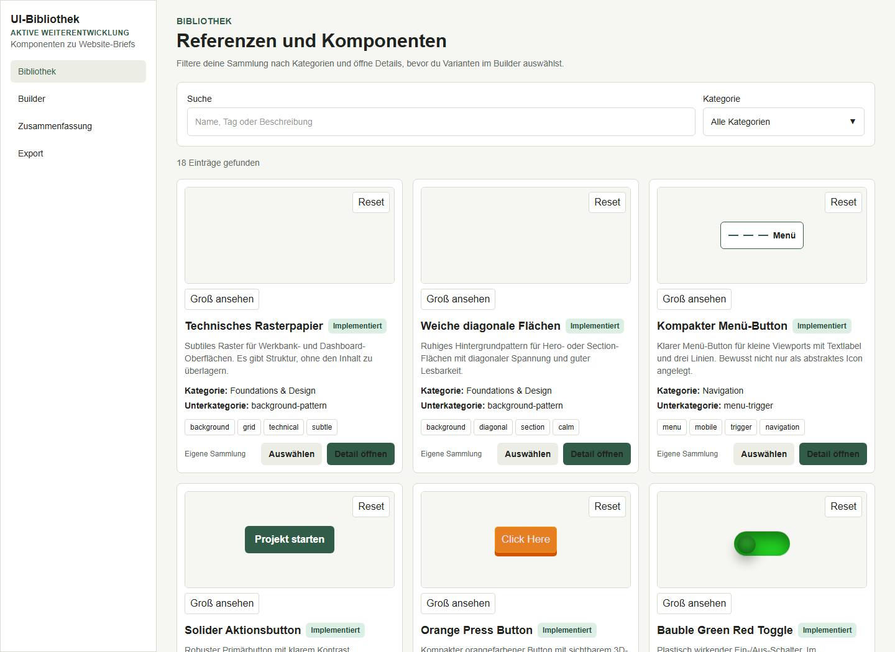
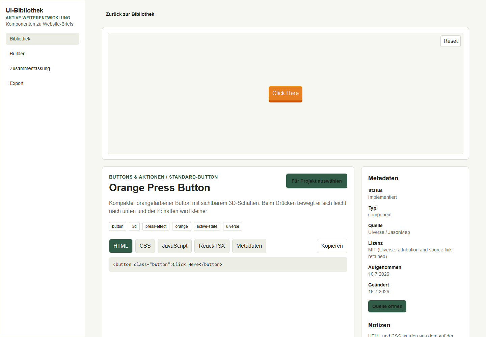
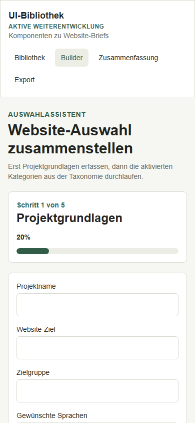

# UI Component Library Builder

**Status: Active Development**

A growing, personal UI component workbench built with Next.js. It combines a searchable component catalog, isolated live previews, and a guided builder that turns selected UI ideas into a structured website brief.

This is an actively maintained portfolio project. The core workflow is implemented and usable; new component categories and examples are added incrementally. It is not presented as a finished npm package or a production-ready design system.

## Screenshots

| Component library | Component details |
|---|---|
|  |  |

<p align="center">
  
</p>

## What is implemented

- A catalog with **18 implemented HTML/CSS component and pattern previews**; one animated pattern also uses JavaScript.
- Text search and category filtering.
- Sandboxed iframe previews with a restrictive Content Security Policy and a reset action.
- Detail pages with source, license, tags, notes, metadata, and separate HTML/CSS/JavaScript/TSX tabs.
- Copy-to-clipboard support for stored code.
- A taxonomy-driven selection builder with single- and multi-select categories.
- Local draft persistence through `localStorage`.
- Review and export screens that generate a Markdown website brief and a structured JSON selection.
- A JSON import utility and duplicate-detection utilities for maintaining the collection.
- Responsive layouts, visible keyboard focus, dark-mode color tokens, and reduced-motion handling.

## Current demo gallery

The gallery reflects the repository as it exists today:

| Category | Available examples |
|---|---:|
| Patterns and backgrounds | 5 |
| Buttons and actions | 2 |
| Navigation controls | 2 menu triggers |
| Inputs and selection | 9 toggles and switches |
| **Total** | **18** |

Full navigation bars and reusable content cards are not yet catalog entries. They are listed in the roadmap instead of being presented as existing features.

## How it works

1. Browse or filter the component library.
2. Open an entry to inspect its live preview, implementation, source, and metadata.
3. Enter project basics in the builder and select components category by category.
4. Review the selection and export it as `WEBSITE-BRIEF.md` and `website-selection.json`.

The category order and selection behavior come from `config/category-taxonomy.json`; they are not hard-coded into the builder UI.

## Technology

- Next.js 16 App Router
- React 19
- TypeScript 5
- Tailwind CSS 4
- Node.js built-in test runner
- Local JSON data and browser `localStorage`

## Project structure

```text
app/                  Routes for library, builder, review, and export
components/           Catalog, preview, filtering, and builder UI
config/               Category taxonomy and selection rules
data/                 Current component registry
design-system/        Visual and interaction source of truth
docs/                 Import format, preview security, and screenshots
lib/                  Data access, export, storage, and duplicate checks
scripts/              Component JSON import utility
tests/                Core workflow tests
types/                Shared TypeScript models
```

More detail is available in [ARCHITECTURE.md](ARCHITECTURE.md).

## Run locally

Requirements: Node.js 20 or newer and npm.

```bash
npm install
npm run dev
```

Open `http://localhost:3000`. The root route forwards to the component library.

## Quality checks

```bash
npm test
npm run typecheck
npm run build
```

## Adding component data

The import script accepts one or more `.component.json` files or folders:

```bash
node scripts/import-component-json.mjs path/to/component-or-folder
```

The expected format is documented in [docs/COMPONENT_IMPORT_FORMAT.md](docs/COMPONENT_IMPORT_FORMAT.md). Imported code should be reviewed for correctness, accessibility, provenance, and licensing before it is committed.

## Sources and licensing

Four catalog entries are original implementations. Fourteen entries are adapted from individual Uiverse contributors and retain their creator names and source links in the component metadata. Uiverse states that its UI elements are published under the MIT License.

See [THIRD_PARTY_NOTICES.md](THIRD_PARTY_NOTICES.md) for attribution. The repository's own code is available under the [MIT License](LICENSE).

## Roadmap

Planned additions are deliberately separated from current functionality:

- Add complete navigation bar examples, beyond the existing menu triggers.
- Add cards and other content/data-display components.
- Expand buttons, patterns, form controls, feedback states, and page-section examples.
- Add filters for context, style, and implementation status.
- Improve modal focus trapping and keyboard focus restoration.
- Integrate schema validation and duplicate review more directly into the import workflow.
- Evolve the local JSON registry behind a persistent storage abstraction when needed.

The roadmap is incremental: existing catalog and builder behavior remains the stable core while the library grows.

## Known limitations

- The catalog currently contains examples in four populated categories, although the taxonomy defines more future categories.
- Component data is stored in a local JSON file; there is no multi-user backend.
- Builder drafts are local to one browser profile.
- Stored examples are HTML/CSS-first; React/TSX variants are not yet available for every entry.
- Importing is a command-line maintenance workflow, not an in-app upload flow.

